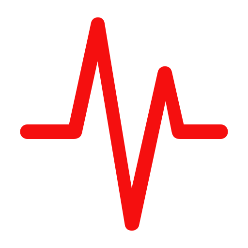
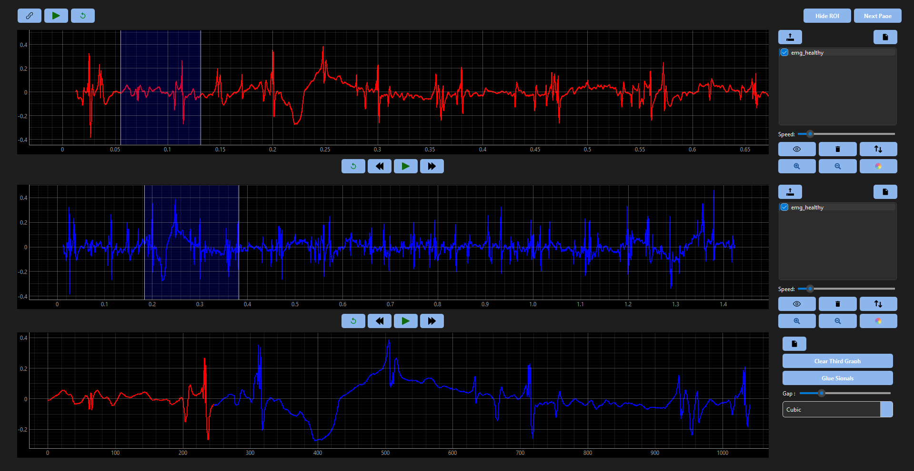

<!-- PROJECT LOGO -->
<br />
<div align="center">
  <a>
    
  </a>

  <h3 align="center">Signal Viewer</h3>

  <p align="center">
    Your best solution to viewing signals!
</div>


<!-- TABLE OF CONTENTS -->
<details>
  <summary>Table of Contents</summary>
  <ol>
    <li>
      <a href="#about-the-project">About The Project</a>
      <ul>
        <li><a href="#built-with">Built With</a></li>
      </ul>
    </li>
    <li><a href="#features">Features</a></li>
    <li><a href="#installation">Installation</a></li>
    <li><a href="#usage">Usage</a></li>
    <li><a href="#contributing">Contributing</a></li>
    <li><a href="#contact">Contact</a></li>
  </ol>
</details>


<!-- ABOUT THE PROJECT -->
## About The Project



**Signal Viewer** is a powerful and intuitive application for visualizing and analyzing biomedical signals such as ECG, EEG, and EMG. With a user-friendly interface, this tool allows for easy loading, display, and interaction with various signal datasets, making it essential for researchers, clinicians, and students in biomedical engineering.

## Features

- **Multi-Signal Visualization**: Display multiple signals simultaneously with synchronized controls.
- **Play/Pause Functionality**: Control signal playback with play and pause buttons.
- **Zoom and Pan**: Zoom in and out, and pan for detailed signal inspection.
- **Linked Controls**: Synchronize playback and control across multiple signal graphs.
- **Signal Alignment**: Align the speed of multiple signals for comparative analysis.
- **Region of Interest (ROI)**: Highlight specific regions of the signal for focused analysis.
- **Signal Processing**: Perform operations such as signal extraction, gap/overlap processing, and signal merging.
- **Report Generation**: Generate detailed reports on the analyzed signals.
- **Customizable Interface**: Modify the appearance and layout to suit your needs.

## Installation

1. **Clone the repository**:
   ```bash
   git clone https://github.com/yourusername/signal-viewer.git
   ```

2. **Navigate to the project directory**:
   ```bash
   cd signal-viewer
   ```

3. **Install the required dependencies**:
   ```bash
   pip install -r requirements.txt
   ```

## Usage

1. **Run the main application**:
   ```bash
   python main.py
   ```

2. **Load signal datasets** from the `Datasets` directory.

3. **Control playback** using the play, pause, zoom, and pan buttons.

4. **Synchronize playback** for multiple signals using linked controls.

5. **Highlight regions of interest** and perform signal processing as needed.

6. **Generate reports** for detailed analysis and documentation.

## Project Structure

- **`main.py`**: Initializes and runs the Signal Viewer application.
- **`GraphWidget.py`**: Contains the `GraphWidget` class for rendering and interacting with signal graphs.
- **`ReportDialog.py`**: Handles generation and display of signal analysis reports.
- **`Datasets`**: Directory for sample signal datasets.
- **`Styles`**: Directory with QSS files for customizing the app's appearance.
- **`Icons`**: Directory for icons used in the application.

## Contributing

We welcome contributions to enhance Signal Viewer’s functionality and usability! Follow these steps to contribute:

1. **Fork the repository**.
2. **Create a new branch**:
   ```bash
   git checkout -b feature-name
   ```

3. **Make your changes** and commit:
   ```bash
   git commit -m "Add your message here"
   ```

4. **Push to the branch**:
   ```bash
   git push origin feature-name
   ```

5. **Open a pull request**.


### Contributors:

<a href="https://github.com/ahmed-226">
  
</a>
<a href="https://github.com/louai111">
  
</a>
<a href="https://github.com/Anasmo1323">
  
</a>
<a href="https://github.com/aliyounis33">
  
</a>


<p align="right">(<a href="#readme-top">back to top</a>)</p>


### Built With

* [![Next][Next.js]][Next-url]
* [![React][React.js]][React-url]
* [![Vue][Vue.js]][Vue-url]

<p align="right">(<a href="#readme-top">back to top</a>)</p>


<!-- CONTACT -->
## Contact
Ahmed Abdelaal - ##@eng-st.cu.edu.eg.com
<br>
Louai Eleslamboly - louai.eleslamboly03@eng-st.cu.edu.eg.com
<br>
Anas Mohamed - ##@eng-st.cu.edu.eg.com
<br>
Ali Younis - ##@eng-st.cu.edu.eg.com
<br>


<p align="right">(<a href="#readme-top">back to top</a>)</p>


<!-- MARKDOWN LINKS & IMAGES -->
<!-- https://www.markdownguide.org/basic-syntax/#reference-style-links -->
[contributors-shield]: https://img.shields.io/github/contributors/othneildrew/Best-README-Template.svg?style=for-the-badge
[contributors-url]: https://github.com/othneildrew/Best-README-Template/graphs/contributors
[forks-shield]: https://img.shields.io/github/forks/othneildrew/Best-README-Template.svg?style=for-the-badge
[forks-url]: https://github.com/othneildrew/Best-README-Template/network/members
[stars-shield]: https://img.shields.io/github/stars/othneildrew/Best-README-Template.svg?style=for-the-badge
[stars-url]: https://github.com/othneildrew/Best-README-Template/stargazers
[issues-shield]: https://img.shields.io/github/issues/othneildrew/Best-README-Template.svg?style=for-the-badge
[issues-url]: https://github.com/othneildrew/Best-README-Template/issues
[license-shield]: https://img.shields.io/github/license/othneildrew/Best-README-Template.svg?style=for-the-badge
[license-url]: https://github.com/othneildrew/Best-README-Template/blob/master/LICENSE.txt
[linkedin-shield]: https://img.shields.io/badge/-LinkedIn-black.svg?style=for-the-badge&logo=linkedin&colorB=555
[linkedin-url]: https://linkedin.com/in/othneildrew
[product-screenshot]: images/screenshot.png
[Next.js]: https://img.shields.io/badge/next.js-000000?style=for-the-badge&logo=nextdotjs&logoColor=white
[Next-url]: https://nextjs.org/
[React.js]: https://img.shields.io/badge/React-20232A?style=for-the-badge&logo=react&logoColor=61DAFB
[React-url]: https://reactjs.org/
[Vue.js]: https://img.shields.io/badge/Vue.js-35495E?style=for-the-badge&logo=vuedotjs&logoColor=4FC08D
[Vue-url]: https://vuejs.org/
[Angular.io]: https://img.shields.io/badge/Angular-DD0031?style=for-the-badge&logo=angular&logoColor=white
[Angular-url]: https://angular.io/
[Svelte.dev]: https://img.shields.io/badge/Svelte-4A4A55?style=for-the-badge&logo=svelte&logoColor=FF3E00
[Svelte-url]: https://svelte.dev/
[Laravel.com]: https://img.shields.io/badge/Laravel-FF2D20?style=for-the-badge&logo=laravel&logoColor=white
[Laravel-url]: https://laravel.com
[Bootstrap.com]: https://img.shields.io/badge/Bootstrap-563D7C?style=for-the-badge&logo=bootstrap&logoColor=white
[Bootstrap-url]: https://getbootstrap.com
[JQuery.com]: https://img.shields.io/badge/jQuery-0769AD?style=for-the-badge&logo=jquery&logoColor=white
[JQuery-url]: https://jquery.com 
